# transfer-learning-fashion-dataset
Applying Transfer Learning on Fashion Product Images Dataset from Kaggle

## Getting started: downloading the data
The best way to download the dataset is to use the kaggle API (see https://github.com/Kaggle/kaggle-api#datasets). Then, you can simply download the .zip file using the following command:

```{r, engine='bash', count_lines}
kaggle competitions download -c fashion-product-images-dataset
```

Finally, you should unzip fashion-product-images-dataset.zip in `DATASET_PATH`.

## Goal:
The goal is to train a classifier on the 142 different `articleType` classes.

## Distribution of the data
The following charts shows how the data among the 142 categories is distributed. 
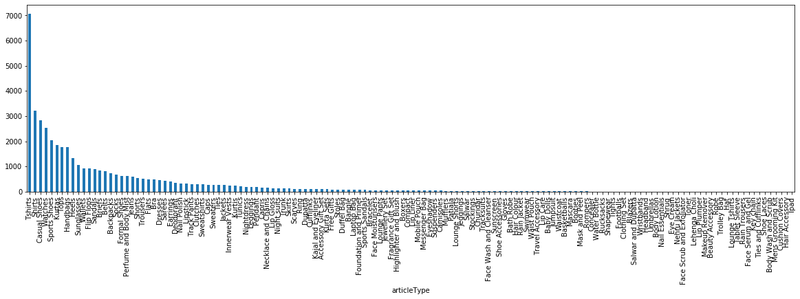 

## Using weighting to handle the imbalanced classes 

Reference: https://towardsdatascience.com/handling-imbalanced-datasets-in-deep-learning-f48407a0e758
Weight balancing balances our data by altering the weight that each training example carries when computing the loss. Normally, each example and class in our loss function will carry equal weight i.e 1.0. But sometimes we might want certain classes or certain training examples to hold more weight if they are more important. That's what we do in the next step: we assign to each class i the following weight w_i:

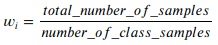 

## Create master train and test splits of the valid image data
Use everything in even years as the training set, and everything in an odd year as the test split.
```{r, engine='python', count_lines}
training_data = styles[styles['year'].astype('int') % 2 == 0]
testing_data = styles[styles['year'].astype('int') % 2 == 1]
```

## Sample data from the training dataset

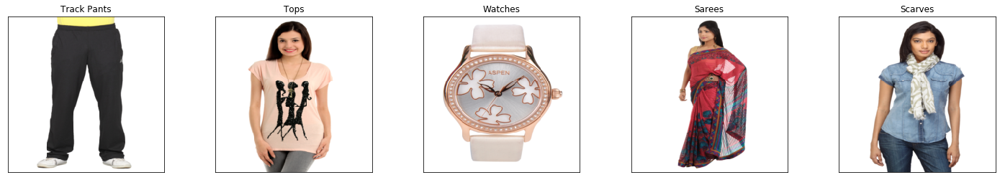 
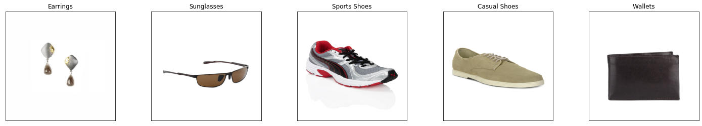 

## Train a classifier using transfer learning
Initializing from ResNet50 trained on ImageNet. ResNet50 is a deep residual network and a very good architecture with 50 layers perfectly suitable for image classification problems.

In the following, we will consider 3 approaches for this problem.

### Approach 1 
See FIDataset_transfer_learning_FConly.ipynb

We freeze the weights for all of the network except that of the final fully connected layer. This last fully connected layer is replaced with a new one with random weights and only this layer is trained.

```{r, engine='python', count_lines}
# Specify model architecture 
model = models.resnet50(pretrained=True)

# Freeze training for all "features" layers
for param in model.parameters():
    param.requires_grad = False
    
# To reshape the network, we reinitialize the classifier’s linear layer
n_inp = model.fc.in_features
model.fc = nn.Linear(n_inp, len(cat_list))
```
We train the network for 20 epochs. The figure below shows train and valid loss during training.

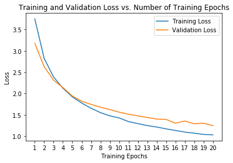 

The overall **test accuracy is:**
```
Top-1 accuracy: 49% (10171/20634) 
Top-5 accuracy: 73% (15263/20634)
```

Below we can see sample images along with predicted and true labels.

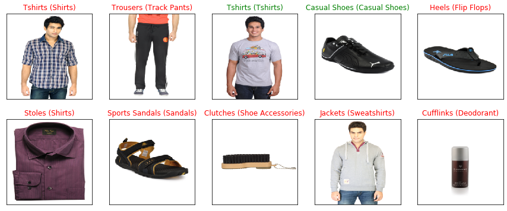 

The top 5 classes with greatest Top-1 accuracy are:

```
Test Accuracy of Sunglasses: 100%
Test Accuracy of Water Bottle: 100%
Test Accuracy of Footballs: 100%
Test Accuracy of  Ties: 97%
Test Accuracy of Backpacks: 94%
```

### Approach 2
See FIDataset_transfer_learning_direct.ipynb

We replace the last fully connected layer with a new one with 142 outputs and retrain the weights of the **whole** network.

```{r, engine='python', count_lines}
# Specify model architecture 
model = models.resnet50(pretrained=True)

# To reshape the network, we reinitialize the classifier’s linear layer
n_inp = model.fc.in_features
model.fc = nn.Linear(n_inp, len(cat_list))
```
We train the network for 20 epochs. The figure below shows train and valid loss during training.

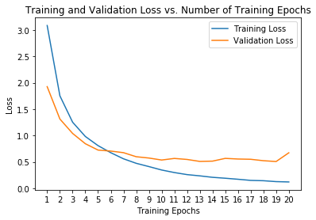 

The overall **test accuracy is:**
```
Top-1 accuracy: 68% (14112/20634) 
Top-5 accuracy: 85% (17586/20634)
```

Below we can see sample images along with predicted and true labels.

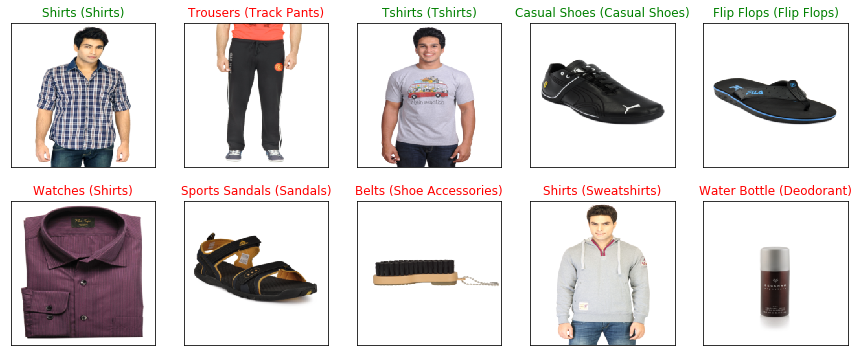 

The top 5 classes with greatest Top-1 accuracy are:

```
Test Accuracy of Sunglasses: 100%
Test Accuracy of Kurta Sets: 100%
Test Accuracy of Earrings: 100%
Test Accuracy of Accessory Gift Set: 100%
Test Accuracy of Water Bottle: 100%
```

### Approach 3
See FIDataset_transfer_learning_2steps.ipynb

In this approach, we take 2 steps to train the classifier. First, we train the full network (all layers) on the top 20 classes (20 outputs). Then we replacing the 20-class FC layer with a 141-class output layer, and fine tune on the rare classes.

#### Step 1: Train the full network (all layers) on the top 20 classes
Retrain the weights of the whole network.

```{r, engine='python', count_lines}
# Specify model architecture 
model_top20 = models.resnet50(pretrained=True)

# To reshape the network, we reinitialize the classifier’s linear layer
n_inp = model_top20.fc.in_features
model_top20.fc = nn.Linear(n_inp, len(top_classes_names))
```
We train the network for 20 epochs. The figure below shows train and valid loss during training.

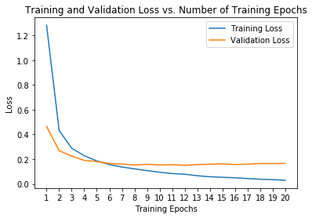 

The overall **test accuracy is 87%** (13243/15143). Below we can see sample images along with predicted and true labels.

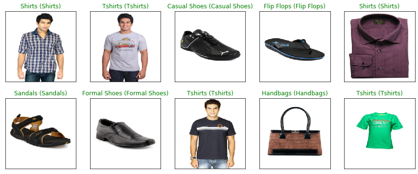 

The top 5 classes with greatest Top-1 accuracy are:

```
Test Accuracy of Watches: 100%
Test Accuracy of Sunglasses: 100%
Test Accuracy of Jeans: 99%
Test Accuracy of Shirts: 99%
Test Accuracy of Belts: 98%
```

#### Step 2: Fine tuning
Replace the 20-class FC layer with a 142-class output layer. Freeze the initial 5 layers of the pretrained model (model_top20) and train just the remaining layers again. The top layers would then be customized to the new data set. Since the new data set contains 122 new classes with low similarity, it is a good idea to retrain and customize the higher layers according to the new dataset. The initial layers are kept pretrained and the weights for those layers are frozen.

```{r, engine='python', count_lines}
# Freeze the first 5 layers of the model
layers_to_freeze=5
layer_count=0

for child in model_142.children():
    layer_count+=1
    if layer_count <= layers_to_freeze:
        for param in child.parameters():
            param.requires_grad = False
            
# To reshape the network, we reinitialize the classifier’s linear layer
n_inp = model_142.fc.in_features
model_142.fc = nn.Linear(n_inp, len(uniquie_article_types))
```
We train the network for 20 epochs. The figure below shows train and valid loss during training.

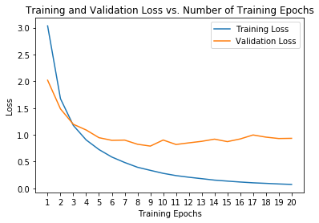 

The overall **test accuracy is:**
```
Top-1 accuracy: 70% (14640/20634) 
Top-5 accuracy: 86% (17746/20634)
```

Below we can see sample images along with predicted and true labels.

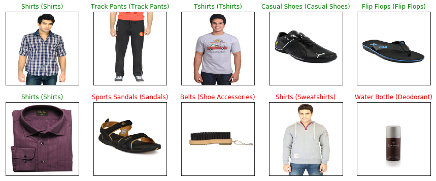 

The top 5 classes with greatest Top-1 accuracy are:

```
Test Accuracy of Sunglasses: 100%
Test Accuracy of Earrings: 100%
Test Accuracy of Accessory Gift Set: 100%
Test Accuracy of Rain Jacket: 100%
Test Accuracy of Water Bottle: 100%
```

## Conclusions

After analyzing those results, we can see that the last approach for training the classifier gives us best results. One thing to improve the accuracy could be using a lower learning rate (e.g. 0.0001) because the current learning rate of 0.001 seems to be too big. In training deep networks, it is helpful to reduce the learning rate as the number of training epochs increases. We could implement and include a 'Learning Rate Scheduler' which would decay the learning rate by some factor (like 0.1) every k epochs.

Also, with the new learning rate we could train the networks for more than 20 epochs to get better results. In other words, we should perform hyperparameter tuning and try out different pairs of hyperparameters. 

Let us have a look on the accuracy of several rare classes that we get using the best, third approach:

```
Test Accuracy of Umbrellas:  0% ( 0/ 5)
Test Accuracy of Body Lotion:  0% ( 0/ 6)
Test Accuracy of Nail Essentials:  0% ( 0/ 6)
Test Accuracy of Shrug:  0% ( 0/ 1)
Test Accuracy of Eye Cream:  0% ( 0/ 6)
Test Accuracy of Nehru Jackets: N/A (no training examples)
Test Accuracy of Face Scrub and Exfoliator:  0% ( 0/ 5)
Test Accuracy of Toner:  0% ( 0/ 5)
Test Accuracy of Lehenga Choli: N/A (no training examples)
Test Accuracy of Lip Plumper:  0% ( 0/ 4)
Test Accuracy of Makeup Remover:  0% ( 0/ 3)
Test Accuracy of Beauty Accessory:  0% ( 0/ 4)
Test Accuracy of  Robe:  0% ( 0/ 3)
Test Accuracy of Trolley Bag: N/A (no training examples)
Test Accuracy of   Hat:  0% ( 0/ 3)
Test Accuracy of Lounge Tshirts: N/A (no training examples)
Test Accuracy of Tablet Sleeve: N/A (no training examples)
Test Accuracy of Rain Trousers:  0% ( 0/ 1)
Test Accuracy of Face Serum and Gel:  0% ( 0/ 2)
Test Accuracy of Key chain:  0% ( 0/ 1)
Test Accuracy of Ties and Cufflinks:  0% ( 0/ 2)
Test Accuracy of Shoe Laces:  0% ( 0/ 1)
Test Accuracy of Body Wash and Scrub:  0% ( 0/ 1)
Test Accuracy of Mens Grooming Kit:  0% ( 0/ 1)
Test Accuracy of Cushion Covers: N/A (no training examples)
Test Accuracy of Hair Accessory: N/A (no training examples)
Test Accuracy of  Ipad: N/A (no training examples)
```

To get better results on the classes with a very small number of training samples, we could perform data augmentation. In that way we enlarge our dataset by making minor alterations (such as flips or translations or rotations) to our existing dataset. 

Another good way to improve classification accuracy of the small classes in particular could be using the metadata from `styles.csv` (e.g. masterCategory and subCategory) as additional labels.


## Improving the model

### Data augmentation 
See FIDataset_transfer_learning_2steps_augmentation.ipynb

The first improvement to the model is using data augmentation. Following the third approach presented before, we apply the following transformation (which includes RandomHorizontalFlip) to the training dataset in step 2:

```{r, engine='python', count_lines}
# Data augmentation
transform_augment = torchvision.transforms.Compose([
                torchvision.transforms.Resize((224, 224)),
                torchvision.transforms.RandomHorizontalFlip(),
                torchvision.transforms.ToTensor(),
                torchvision.transforms.Normalize((0.5, 0.5, 0.5), (0.5, 0.5, 0.5))
            ])
```
We train the model with the same parameters for 20 epochs. The figure below shows train and valid loss during training.

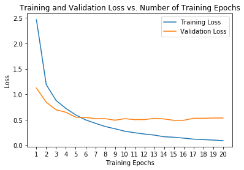 

The overall **test accuracy is:**
```
Top-1 accuracy: 72% (15022/20634) 
Top-5 accuracy: 86% (17791/20634)
```

Below we can see sample images along with predicted and true labels.

 

We can see some minor improvement here (2% better Top-1 accuracy). To see this on an example, please compare the predictions above with the predictions obtained for the same model without augmenting data. Before, the 9th image was classified as "Shirts" and now it is considered as "Sweatshirts" which is the correct class for this item. 

Also note that a good idea would be also including some random rotation or random crop but we leave this for further ivestigation. 

